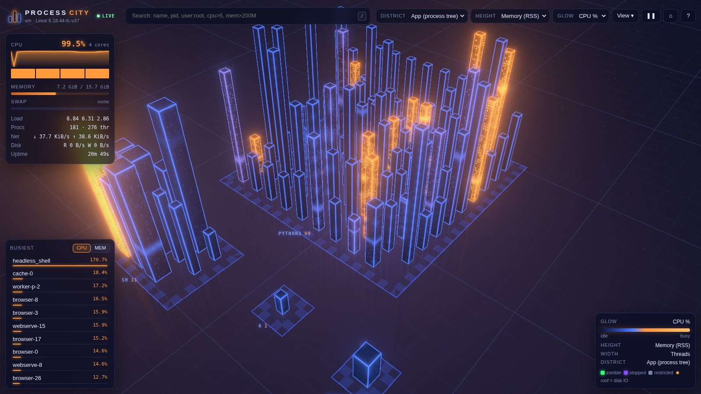
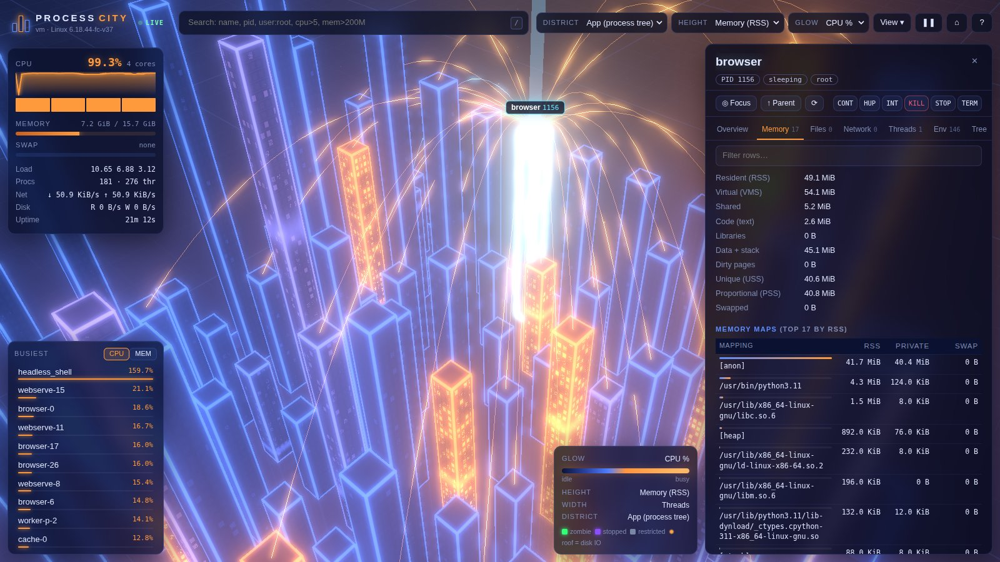

# Process City

Your running processes, rendered as a living 3D neon city. Every process is a glass tower. Towers glow orange when they're busy, grow with the memory they use, rise out of the ground when a process starts and sink when it exits. Click any tower to see everything about that process: command line, environment, open files, sockets, threads, memory maps, limits, cgroups and namespaces.

Works on **Linux** and **macOS**. The only dependency is `psutil`, and three.js is vendored, so it runs fully offline.





## Quick start

```bash
git clone <this repo> && cd linux-process-live-city
./run.sh                 # creates .venv with psutil on first run, opens your browser
```

To see full detail for every user's processes (other users' env, files and sockets are hidden from a normal user):

```bash
sudo ./run.sh
```

Or install it as a command:

```bash
pip install .
process-city
```

### Options

| Flag | Default | |
|---|---|---|
| `--port` | `8765` | HTTP port |
| `--host` | `127.0.0.1` | Bind address. Anything that isn't loopback turns on an auto-generated access token (printed in the URL). |
| `--interval` | `1.5` | Seconds between samples |
| `--allow-signals` | off | Show TERM / KILL / STOP / CONT / HUP / INT buttons in the inspector |
| `--no-browser` | | Don't open a browser tab |

## Reading the city

| Visual | Meaning |
|---|---|
| **Tower height** | Memory (RSS, log scale) by default. Can be switched to CPU, threads, open files, uptime or virtual memory. |
| **Tower width** | Thread count |
| **Glow** (blue → orange) | CPU by default. Can be switched to memory, disk IO, state or age. Busy towers also light more windows and have a scanline that climbs faster. |
| **Roof beacon** | Pulses with disk IO |
| **District** (block) | Processes grouped by app tree (default), user, process name or state |
| Green flicker | Zombie |
| Violet | Stopped (`SIGSTOP`, being traced) |
| Grey | Restricted: owned by another user, so run with `sudo` for detail |
| White flash rising from the ground | A process that just started |
| Arcs | When a tower is selected, cyan arcs go to its parent and orange arcs go to its children. **View → Parent → child links** draws the whole tree. |

## The inspector

Click a tower (or pick one from search or the *Busiest* list) to open it:

- **Overview**: live CPU and memory sparklines, the executable, working dir, full argv, parent, start time, UIDs/GIDs, terminal, nice, IO priority, CPU affinity, CPU times, context switches and IO counters.
- **Memory**: RSS/VMS/USS/PSS/swap and the top memory maps by RSS (Linux).
- **Files**: open file descriptors, with modes and offsets.
- **Network**: TCP, UDP and Unix sockets, with local and remote addresses and state.
- **Threads**: every thread's CPU time.
- **Env**: environment variables. Anything that looks like a secret is masked until you click it.
- **Tree**: the ancestry chain and children, all clickable.
- **Limits**: `RLIMIT_*` soft and hard limits (Linux).
- **Kernel** (Linux): `wchan`, OOM score, cgroups, namespaces, the full `/proc/<pid>/status` and scheduler stats.

## Controls

| | |
|---|---|
| drag / right-drag / scroll | orbit / pan / zoom |
| click / double-click | inspect / zoom into a tower |
| `/` | search |
| `F` | fly to the selection |
| `P` | jump to the parent process |
| `R` | reset camera |
| `Space` | pause updates |
| `Esc` | close |
| `?` | help |

### Search syntax

Terms are separated by spaces and all of them must match:

```
firefox                 name, command line, user or pid contains "firefox"
user:root name:ssh      field contains
cmd:--port status:running ppid:1
cpu>5  mem>500M  threads>=20  fds>100  nice<0
```

Matches stay lit and everything else fades out. Press `Enter` to fly to the top result.

## How it works

```
livecity/
  collector.py   background sampler (psutil) + on-demand deep details
  server.py      stdlib HTTP server: JSON API + static frontend
  web/
    js/city.js       three.js scene: one InstancedMesh + custom GLSL shader for all towers,
                     mirrored reflection pass, bloom, district plates, lineage arcs
    js/layout.js     grouping → districts → shelf-packed city plan, metrics, search language
    js/inspector.js  the detail drawer
    js/main.js       HUD, search, leaderboard, polling
    vendor/three/    three.js r186 (MIT)
```

- `GET /api/snapshot`: every process (pid, ppid, name, user, state, CPU%, RSS/VMS, threads, FDs, IO rate, …) plus system stats. It is served from memory and refreshed every `--interval`.
- `GET /api/process/<pid>`: the deep dive, gathered on demand. Each field that can't be read is reported in `errors` rather than failing the whole request.
- `POST /api/process/<pid>/signal`: only with `--allow-signals`. It refuses pid 1 and the server itself.

Security: the server binds to `127.0.0.1` by default and rejects requests whose `Host` header isn't localhost, which blocks DNS rebinding. POSTs require a custom header, so another website can't trigger them cross-origin. Binding to a non-loopback address requires a random token.

## Development

```bash
python3 -m unittest -v     # collector + server tests
```

## Third-party

three.js is © three.js authors, MIT licensed (see `livecity/web/vendor/three/LICENSE`).
